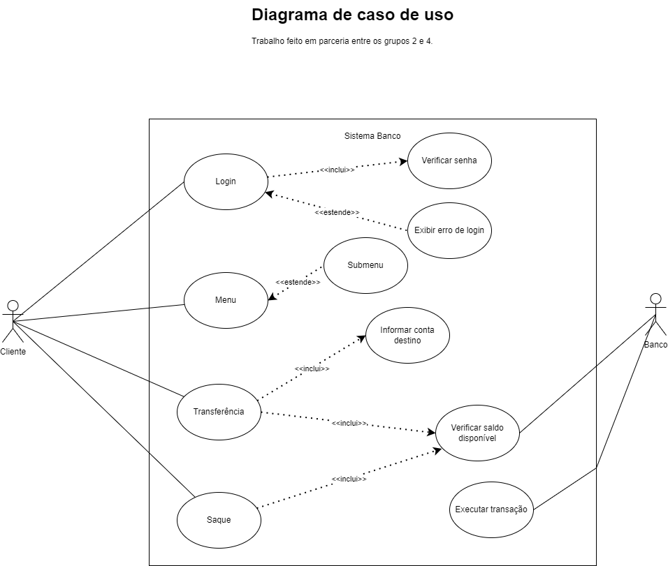

# POO-G4
 ## :detective: Índice

* Sobre o Projeto
* Tecnologias utilizadas
* Diagrama
* Autores do Projeto

## Sobre o Projeto
O projeto visa o desenvolvimento de um pequeno sistema de um Banco fictício, denominado UruBank.

Tal sistema possui diferentes classes para representar as entidades do negócio, assim tendo métodos para suprir as necessidades da operação diária do Banco.
 
O sistema é capaz de ler o arquivo "banco.txt" localizado na pasta temp, assim simulando um banco de dados.
	
Algumas funcionalidades do sistema são:
* Tela de seleção de cargo;
* Sistema de login funcional;
* Sistema de cadastro funcional, afetando o banco de dados;
* Diferente hierarquia de cargos, que possuem diferentes funcionalidades exclusivas (Gerente, Diretor e Presidente);
* Cadastro de novos clientes sendo feitos por gerentes;
* Cadastro de novos gerentes sendo feitos por diretores;
* Cadastro de novos diretores sendo feitos por presidentes;
* Implementação de conta bancária e operações financeiras funcionais, que podem gerar extrato em arquivo .txt;
* Registro de todas as operações realizadas em uma execução via arquivo .txt;
* Tratamento de erros personalizado.

O projeto foi realizado durante o período aproximado de 13 dias, durante a disciplina de Programação Orientada a Objetos da Residência em TIC/Software do Serratec.

##  Tecnologias utilizadas
- [Java 17](https://www.oracle.com/java/technologies/javase/jdk17-archive-downloads.html)
- [Eclipse (Spring Tool)](https://spring.io/tools)
- [GitHub](https://github.com/)

##  Diagramas

 
##  UML Classes

 
##  UML Caso de Uso

## Autores

- [Paulo Henrique](https://github.com/paulooosf)
- [Matheus Henrichs](https://github.com/MatheusHenrichs)
- [Victor Hugo M. França](https://github.com/VictorHmfr)
- [Renato Augusto](https://github.com/renatocrachmad)
- [Gabriel Pimentel](https://github.com/GabrielnPimentel)
  
 